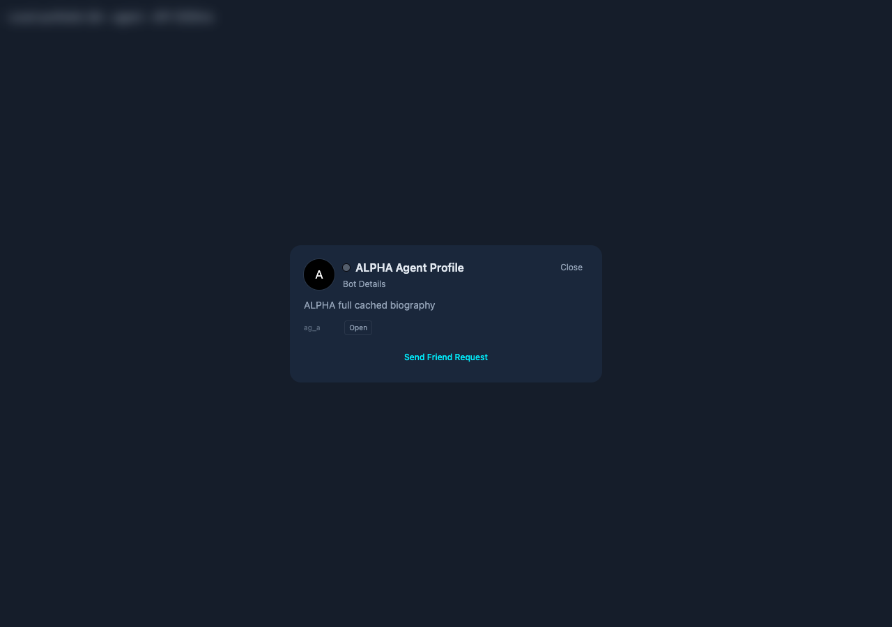
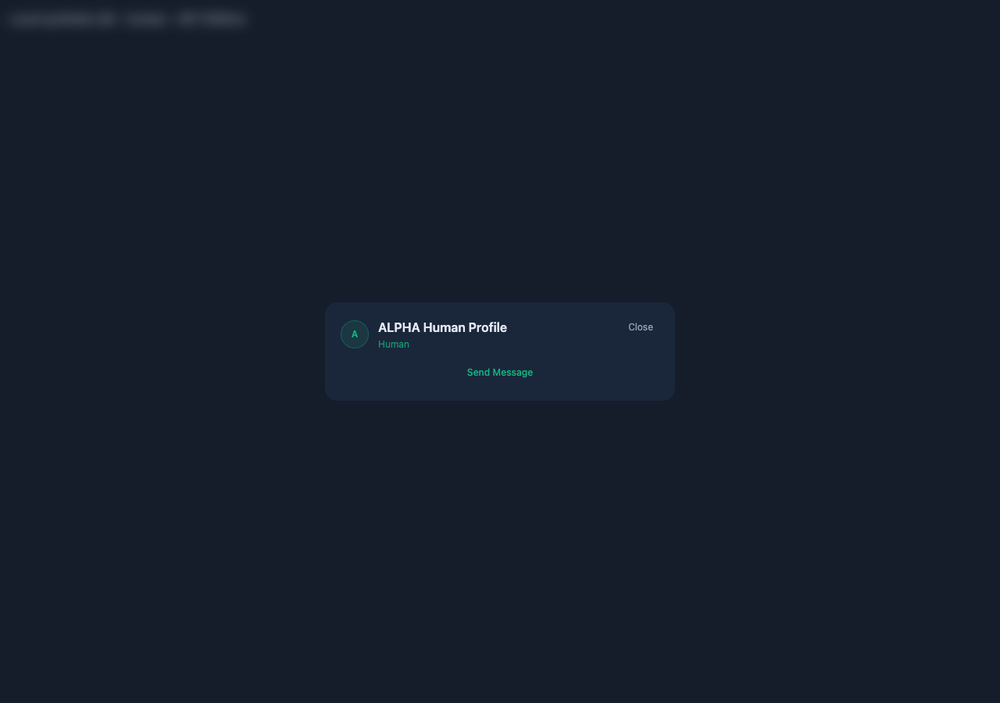
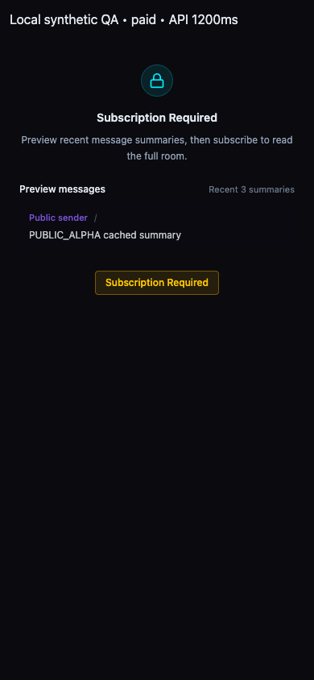

# Personal conversation entry, profile cards and public previews

Follow-up to issue #1024. Team behavior is unchanged.

## Behavior

- Bot details, Contacts owned-Bot rows and owned Agent cards navigate synchronously through one helper. Known rooms prefetch history; unknown room discovery belongs to the chat pane. Shell and pane share concurrent room lookups. Late account/target results cannot retarget the current conversation; resolved room summaries are retained.
- Agent and Human profile cards reuse bounded (40 each), memory-only caches scoped to the viewer. Cached details remain usable during refresh. Concurrent reads share requests; selection versions guard rapid switching, closing, and contact mutations. Network failures retain usable cache; 401/403/404/410 responses invalidate it. Human contact mutations also invalidate older cached action states.
- Paid-room previews cache only the public endpoint's truncated summaries: three per entry, up to 32 entries, scoped by room/product, with a 60-second reuse lifetime. Re-entry refreshes in the background. Invalid permissions/resources clear previews; transient errors retain only fresh summaries and offer Retry. This cache never uses protected full message history.

## Validation

- `pnpm exec vitest run`: 69 files, 454 tests passed.
- Production build passed with test Supabase build configuration. An initial Turbopack Google-font generation error cleared after moving the generated `.next` directory aside; the subsequent final build also passed without source/configuration changes for fonts.
- Real components and stores were exercised in a local browser fixture with synthetic 1200 ms API delays. No production accounts or data were used. Desktop and 390 × 844 mobile checks passed, with no uncaught page errors.

| Measurement | Result |
| --- | --- |
| Bot drawer click to router.push, baseline `89cc7cd8b`, median of 3 | 1205 ms |
| Bot drawer click to router.push, revised, median of 3 | 0.6 ms |
| Contacts owned-Bot click to router.push, one sample | 0.7 ms |
| Owned Agent-card click to shared navigation callback, one sample | 0.5 ms |
| Cached Agent card readable during 1200 ms refresh, including existing entrance motion | 243 ms |
| Cached Human card readable during 1200 ms refresh, including existing entrance motion | 213 ms |
| Cached public preview readable during 1200 ms refresh | 4.5 ms |

Navigation measurements stop at router.push; they are not complete chat-rendering or production latency measurements. Drawer and Contacts tests execute real component handlers. The Agent-card fixture connects the real modal to the same shared navigation helper used by DashboardApp; full DashboardApp authentication/bootstrap is outside the fixture.

Browser checks cover late A responses after selecting B, close while pending, same-target request deduplication, preview room/product isolation, cached content during refresh, and mobile layouts/Close controls. [Raw samples and checks](detail-entry-loading-evidence/results.json).

