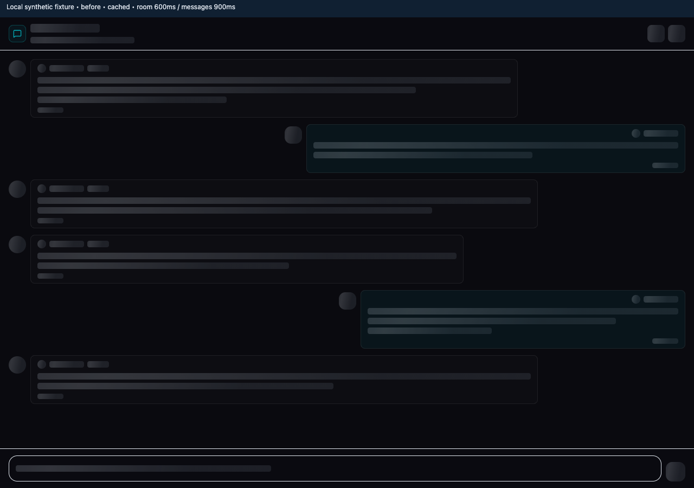
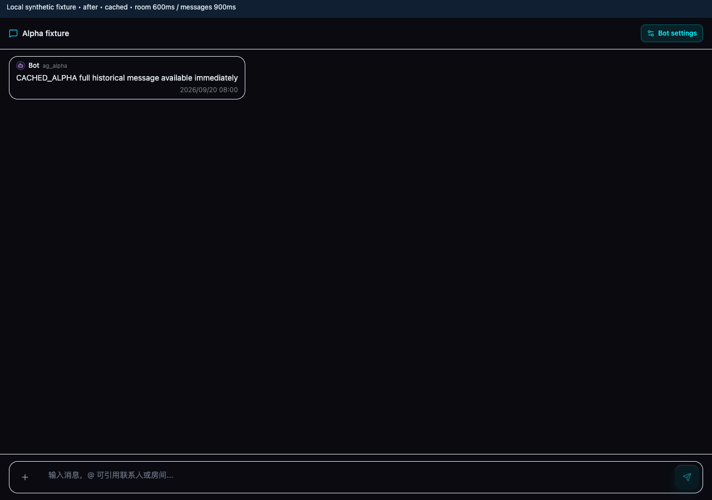
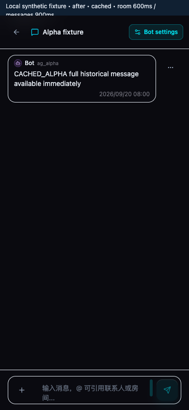

# Conversation detail loading

Issue: #1024. Comparison baseline: `cb699ac29` (main after #1023).

## Changes

- Owner chat resolves an existing, matching Bot-owned room from the conversation summaries before falling back to the room API. Optimistic `rm_oc_pending_` identifiers never bypass discovery.
- The owner pane consumes the dashboard's chronological history cache immediately, including an empty loaded page. Background refresh errors retain readable content.
- Opening history shares the pending list-prefetch request. Request versions still fence room changes, removed rooms, and account/session resets.
- List prefetch includes real owner chats, prioritizes unread/recent rooms, and queues at most six pages with two concurrent requests. Selecting a conversation stops queued speculative work. Pointer hover, focus, and touch can start the intended room's history early.
- Ordinary message panes stop automatically retrying a failed first page; the existing Retry action remains available.

## Scope

These changes reduce client-side waiting and duplicate history requests. They do not establish production API latency or change backend query behavior. Stream recovery, live messages, optimistic sends, pagination, and mobile navigation remain part of regression coverage.

## Browser measurements

The real React pane and stores ran in a local Vite fixture with isolated auth, WebSocket, and navigation adapters. Both baseline and revised code received the same dashboard cache. Room lookup took a synthetic 600 ms and history took 900 ms. Bundle loading was outside the timer.

The primary metric was component mount to the first animation frame with the full historical bubble inside the viewport, positive dimensions, and opacity at least 0.95 on the bubble and its ancestors. Five samples per variant:

| Scenario | Baseline | Revised |
| --- | ---: | ---: |
| Cached history, median first visible frame | 1560.2 ms | 49.7 ms |

The revised cold known-room path took approximately 955 ms; the unknown-room fallback still took approximately 1543 ms. These are local synthetic timings, not production measurements.

Eight browser checks passed: cached content during refresh, cold known/unknown rooms, switching Bots with late responses (79 sampled frames without cross-room text), refresh failure retaining content, and mobile return navigation in cached/loading/Bots states. No uncaught browser errors occurred.

[Full samples and checks](message-detail-loading-evidence/results.json).

At 200 ms, with the same cached data and delayed API:

## Automated validation

- `pnpm exec vitest run`: 64 files, 407 tests passed.
- `NEXT_PUBLIC_SUPABASE_URL=https://example.supabase.co NEXT_PUBLIC_SUPABASE_ANON_KEY=test-anon-key npm run build`: production build passed.
- Focused coverage includes synchronous cached rendering, empty pages, shared pending reads and re-entry, room/account isolation, delayed replies after reset, server corrections, live/optimistic/streaming merges, pagination state, bounded prefetch, and failure retry behavior.
