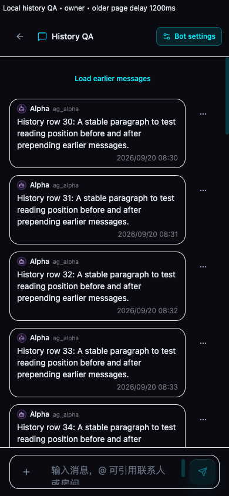
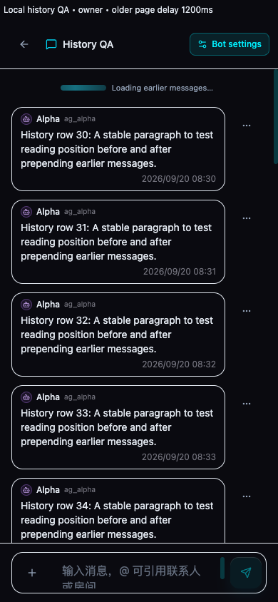
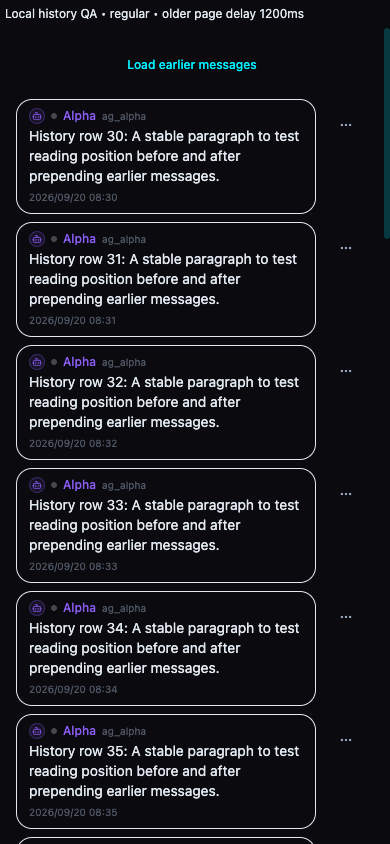

# Mobile history pagination

Fixes #1027. Personal owner chats and ordinary conversations use an explicit “Load earlier messages” button on phones and touch devices. Desktop automatic pagination requires a viewport at least 768 px wide, hover support, and a fine pointer. CSS and the scroll handler share that media condition.

Message containers contain vertical overscroll. History loading, failure retry and terminal pagination retain their existing behavior. Visible-message anchors restore after the loading indicator settles; prepended owner history renders without typewriter animation so its height stays stable. Owner history retains a raw page cursor even when an entire page contains no visible messages.

Validation: 70 Vitest files / 458 tests pass; production build passes with test Supabase configuration. Browser fixtures use real UserChatPane and MessageList with 1200 ms simulated older-page responses. In a 390 px touch viewport, top scrolling/dragging sends zero history requests, a double click sends one, and loading removes the repeat action. Both panes preserve the sampled message position (0 px final drift); desktop fine-pointer scrolling still loads history. [Results](mobile-history-evidence/results.json).

Chrome touch emulation does not establish real iOS Safari pull-to-refresh behavior; an actual iPhone check remains useful. The new interaction requires no boundary pull gesture.

